Final project for DCS 375: Network Analysis (Winter 2025)

# Does Being More Socially Connected in Training Improve Fitness Among Bates Women’s Cross Country Athletes?

This project explores whether athletes who are more socially connected in training tend to show greater fitness improvement over the course of a cross country season. Using Garmin/Strava data and self-reported training ties from the Bates women’s cross country team, I built a social network to analyze patterns between training connections and changes in heart rate-to-pace ratio. The goal is to see if being part of a more connected training group has any relationship to individual performance gains.


## Introduction
For my final project, I wanted to explore how social training connections relate to fitness changes over the course of a cross country season. This question matters because teammates often train in groups, and I was curious whether being more socially connected in training might help runners improve more. I collected data from my team’s Garmin and Strava stats — including average heart rate and pace during easy runs — and combined that with survey responses on who each athlete trained with, to build a network and analyze changes in fitness.

Garmin and Strava are popular tools that runners use to track stats like heart rate and pace, which can show how their fitness is changing over time. I thought it would be interesting to combine that kind of fitness data with how runners train together — basically looking at whether social training patterns might impact how much someone improves. As Weingart (2011) explains, networks are especially useful when analyzing interdependence, rather than isolated outcomes — which is exactly what this project aims to explore.

## Methods
To collect my data, I created a short survey and sent it to my cross country teammates. The survey had two main sections. In the first section, athletes were shown a list of teammates and asked to select how often they trained with each one: “regularly,” “occasionally,” or “never.” This data was used to build the social network, where each athlete became a node, and connections (edges) were formed between athletes who trained together. I assigned edge weights based on the strength of the connection — a weight of 2 for “regularly,” a weight of 1 for “occasionally,” and no connection for “never.”

The second section of the survey asked each athlete to report their average heart rate and pace during easy runs based on their Garmin or Apple Watch data. They were asked to enter these values for three time periods: preseason (August), peak season (early October), and end of season (late November). I used this information to calculate a fitness efficiency score for each athlete by dividing heart rate by pace, and then measured fitness change as the difference between their peak season and end-of-season scores.

I used R to build the network using the igraph package. Each athlete’s survey data became a node with added attributes for fitness metrics. I also used the tidyverse for cleaning and organizing the data. This structure follows network analysis practices outlined in Understanding Graphs and Networks in Archaeology and History (Knappett, 2013), particularly around edge weight and centrality. I also drew on Barabási’s (2002) framework from Linked, which explains how highly connected nodes — or “hubs” — can play a larger role in shaping the dynamics of a network. In this case, I was curious whether more central athletes might also be those who improved most.

### Ethical Considerations to keep in mind 
This project involved personal data from my teammates, so I made sure to keep everything anonymous and respectful throughout the process. Names were removed and replaced with labels like Athlete A, B, C, etc., so no one could be identified in the network or results. The survey didn’t ask for any sensitive health information — just self-reported training connections and stats like heart rate and pace pulled from fitness apps that runners already use to track their progress.

As boyd and Crawford (2011) explain, “raw data is an oxymoron” — all data is shaped by choices. In this case, athletes decided which runs to report based on what they felt best represented their training, which adds a layer of subjectivity. Some may have chosen their best week, while others reported more typical runs. I kept that in mind when interpreting the results, since even clean-looking data can reflect individual judgment. This project wasn’t about tracking exact performance, but about noticing bigger patterns between fitness and training group dynamics.

## Data Load + Cleaning
I loaded two datasets into R: one with training connections (the edge list) and another with fitness data for each athlete. In the edge list, I renamed all athletes as Athlete A, B, C, etc., to keep the data anonymous. I also cleaned the fitness data by filtering out any responses with missing or non-numeric values (such as “I was injured”) and made sure all entries for heart rate and pace were in numeric form.

To measure fitness improvement, I used each athlete’s average heart rate and pace during easy runs at three time points: preseason (August), peak season (early October), and end of season (late November). I calculated a heart rate-to-pace ratio for each time point, then looked at the change from peak season to end of season to capture how much each athlete improved. A lower ratio at the end of the season meant the athlete had improved in cardiovascular efficiency.

### Included Files:
- XCdata.Rmd — R Markdown file with all code and analysis

- XCdata.html — Rendered HTML report showing network graphs, visualizations, and findings

- EdgeList_FitnessData.xlsx — Cleaned dataset with training ties and Garmin/Strava data from teammate survey responses

The analysis was done using R, with packages like igraph and tidyverse to build the network and explore relationships through visualizations, statistics, and basic modeling.

## Excel Data Snapshots

Here’s a quick look at what the cleaned data files looked like

**Training Connections (Edge List):**

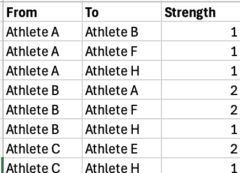

**Fitness Data (Heart Rate and Pace Stats):**

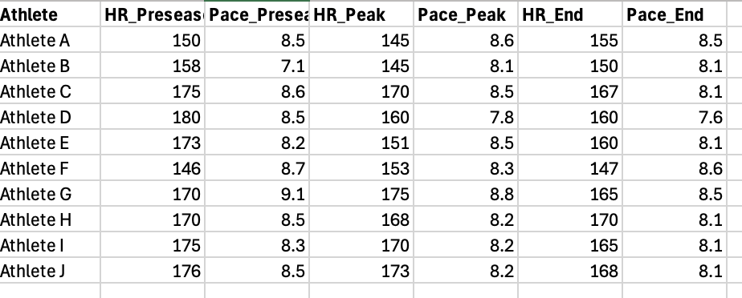


## Key Visualizations

### Network of Training Relationships Colored by Fitness Change
This plot shows how athletes are connected based on who they trained with. Blue nodes show athletes who improved more (greater drop in HR/Pace), while red indicates less improvement.

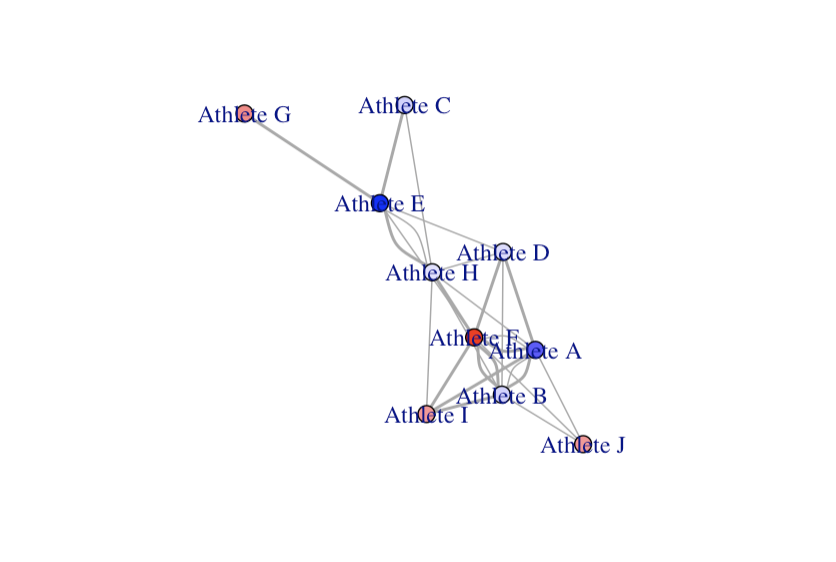

### Visualization 1: Training Network Colored by Fitness Change

This plot shows how athletes are socially connected based on who they trained with, and how their fitness changed from peak to end of season. Blue nodes improved more (greater drop in HR/Pace), and red nodes improved less.

```{r}
# Set node colors based on fitness improvement
colors <- colorRampPalette(c("blue", "white", "red"))(100)
fitness_range <- range(V(g)$Fitness_Change, na.rm = TRUE)
color_index <- round((V(g)$Fitness_Change - fitness_range[1]) / diff(fitness_range) * 99) + 1
vertex_colors <- colors[color_index]

# Plot the training network
plot(g,
     vertex.label = V(g)$label,        # athlete names (Athlete A, B, etc.)
     vertex.size = 10,                 
     vertex.color = vertex_colors,     # color based on fitness change
     edge.width = E(g)$Strength)        # edge width based on training strength
```


```{r}
# Who is the most socially connected in training?
# Color network by how connected each athlete is (degree)
fitness$Degree <- degree(g)

# Calculate how connected each athlete is
fitness$Degree <- degree(g)

# Set node color based on degree (number of training connections)
V(g)$color <- fitness$Degree

# Plot the network again with new coloring
plot(g,
     vertex.label = V(g)$label,
     vertex.size = 10,
     vertex.color = V(g)$color,
     edge.width = E(g)$Strength,
     main = "Network Colored by Number of Training Connections")
```
This network shows how socially connected each athlete is based on the number of people they regularly or occasionally trained with. Athletes with more training connections are shown in brighter colors, while less connected athletes appear darker. For example, Athlete F is one of the most connected runners on the team, while Athlete G trained with fewer teammates and sits more on the edge of the network.

### Fitness Change Over the Season

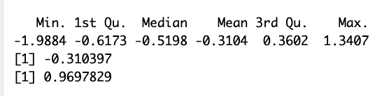

```{r}
# Calculating Fitness_Change
fitness <- fitness %>%
  mutate(
    HR_Pace_Peak = HR_Peak / Pace_Peak,
    HR_Pace_End = HR_End / Pace_End,
    Fitness_Change = HR_Pace_Peak - HR_Pace_End
  )

#Summary stats of data 
summary(fitness$Fitness_Change)
mean(fitness$Fitness_Change, na.rm = TRUE)
sd(fitness$Fitness_Change, na.rm = TRUE)

```
On average, athletes on my team showed a small improvement in fitness over the season, with a mean HR/Pace change of -0.31. The majority of runners had negative values, meaning their heart rate got lower for the same pace — a sign of improved efficiency. However, the range was wide (from -1.99 to +1.34), and the standard deviation of 0.97 shows that the amount of improvement varied a lot from person to person.

### Barplot of Training Connections per Athlete

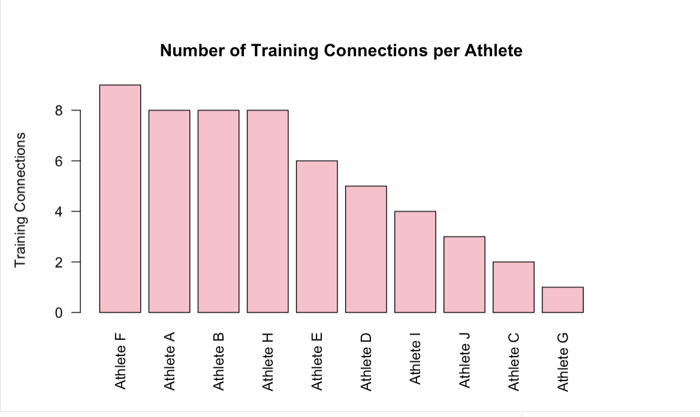

```{r}
# Calculate degree (number of training connections) for each athlete and add it to fitness dataframe
fitness$Degree <- degree(g)

# Barplot of training connections per athlete
barplot(sort(fitness$Degree, decreasing = TRUE),
        names.arg = fitness$Athlete[order(-fitness$Degree)],
        las = 2,
        col = "pink",
        main = "Number of Training Connections per Athlete",
        ylab = "Training Connections")
```
This bar plot shows how many teammates each athlete trained with during the season. A higher number means they were more connected and trained with more people. It’s based on how often others said they trained with them, either regularly or occasionally. Athletes like F, A, and B were some of the most connected, while athletes like C and G trained with fewer teammates, possibly sticking to smaller groups or doing more runs on their own. Athlete F had the most connections (9), while Athlete G had the fewest (1) and most athletes trained with 4–8 teammates.

### Centrality Scores by Athlete

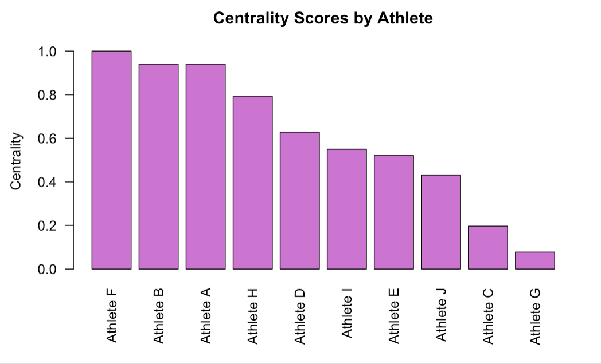

```{r}
# Calculating how central each athlete is in this training network
# This looks at how connected individuals are to other well-connected teammates
fitness$Centrality <- eigen_centrality(g)$vector

# Print centrality scores to see who is most central
print(fitness[order(-fitness$Centrality), c("Athlete", "Centrality")])

# Make a barplot showing centrality scores for each athlete
barplot(sort(fitness$Centrality, decreasing = TRUE),
        names.arg = fitness$Athlete[order(-fitness$Centrality)],
        las = 2,
        col = "orchid", 
        main = "Centrality Scores by Athlete",
        ylab = "Centrality")
```
This plot shows how central each athlete is in the team’s training network. Athletes like Athlete F and Athlete B had the highest centrality, meaning they trained with teammates who were also highly connected. This puts them at the core of the group’s training web. On the other end, athletes like Athlete G and Athlete C were more on the edges — they had fewer connections to teammates who were themselves well-connected. Centrality helps highlight who might’ve been at the social or motivational center of team workouts.

### Distribution of Fitness Change


```{r}
# Adding fitness change to the data
# (heart rate per pace at peak - at end of season)
fitness <- fitness %>%
  mutate(
    HR_Pace_Peak = HR_Peak / Pace_Peak,
    HR_Pace_End = HR_End / Pace_End,
    Fitness_Change = HR_Pace_Peak - HR_Pace_End
  )

# creating histogram of fitness change
# (lower values = more improvement)
hist(fitness$Fitness_Change,
     main = "Distribution of Fitness Change",
     xlab = "HR/Pace Change",
     col = "green")  


```

This histogram shows how fitness changed for my cross country team from peak to end of season. A lower number means someone improved (their heart rate got lower for their pace), and a higher number means they didn’t. Most of my teammates had a fitness change below zero, showing improvement, with the average around -0.31. The most improved runner had a value close to -1.99, while the least improved was around +1.34. This shows that while most of the team made progress, a few athletes didn’t see the same level of improvement.


### Fitness Change by Training Connection Group

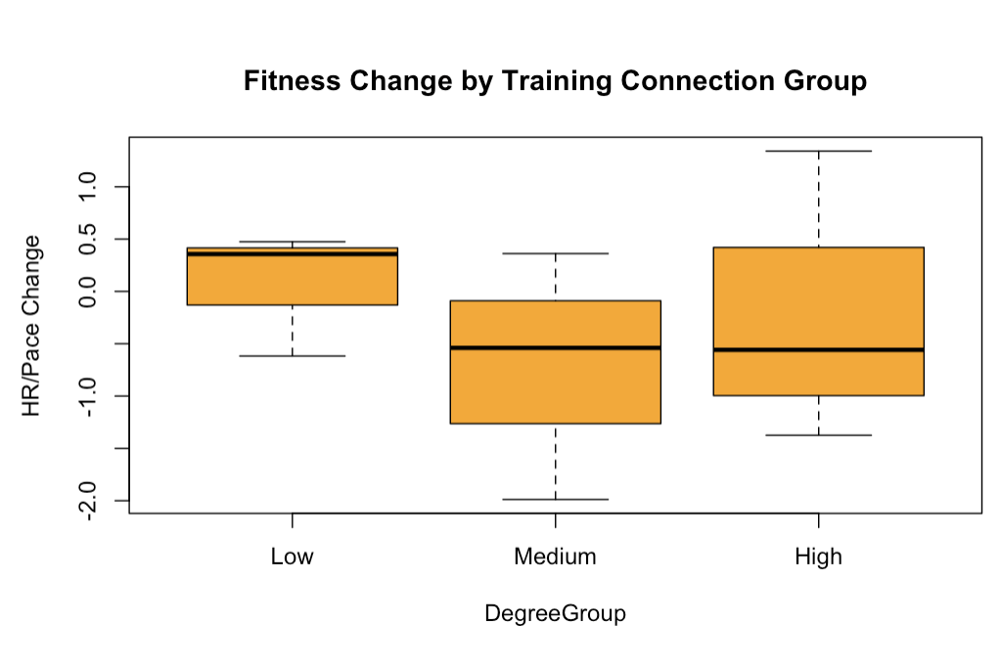

```{r}
# Grouping athletes by how many teammates they trained with
# Low = 0–3 connections, Medium = 4–6, High = 7–10
fitness$DegreeGroup <- cut(fitness$Degree,
                           breaks = c(0, 3, 6, 10),
                           labels = c("Low", "Medium", "High"))

# Making a boxplot to compare fitness change across those 3 groups
boxplot(Fitness_Change ~ DegreeGroup, data = fitness,
        main = "Fitness Change by Training Connection Group",
        ylab = "HR/Pace Change",
        col = "orange")  # makes the plot orange


```
This boxplot shows how fitness change compares across athletes with low, medium, and high training connection groups. The medium and high groups had a wider range, meaning some athletes improved a lot while others didn’t. The low group had more consistent results, but their fitness change was mostly positive, which actually means they got slightly worse. So being more connected didn’t guarantee better results, but it came with more variability.

### Scatterplot: Training Connections vs. Fitness Change

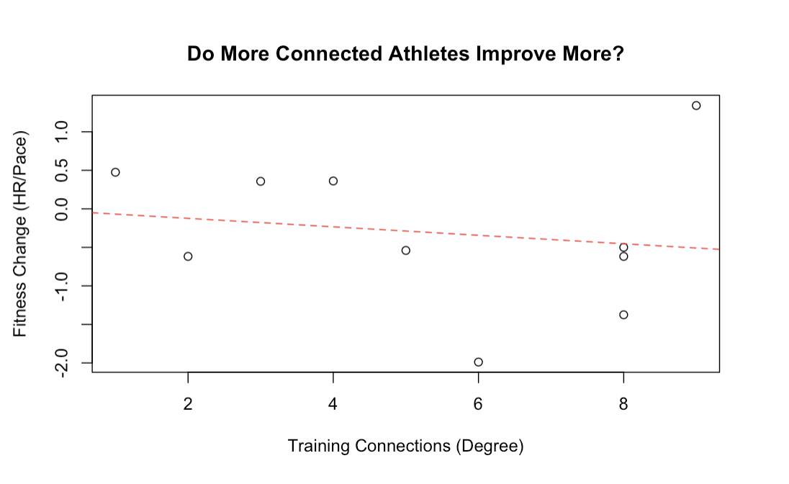

```{r}
#Network Centrality
# Calculating degree (number of connections)
fitness$Degree <- degree(g)

# Scatterplot: Degree vs Fitness Improvement
plot(fitness$Degree, fitness$Fitness_Change,
     main = "Do More Connected Athletes Improve More?",
     xlab = "Training Connections (Degree)",
     ylab = "Fitness Change (HR/Pace)")
abline(lm(Fitness_Change ~ Degree, data = fitness), col = "red", lty = 2)

```
This scatterplot looks at whether more connected athletes (those with more training partners) saw bigger fitness improvements. The x-axis shows how many teammates each person trained with (ranging from 1 to 9 connections), and the y-axis shows their fitness change. The trendline has a slight negative slope, meaning athletes with more connections actually tended to improve a little less. For example, one athlete with 6 training connections had the biggest improvement (around -1.99), while the athlete with the most connections (9) had one of the highest values — close to +1.34 — meaning they didn’t improve as much. So being more connected didn’t always mean better results.


### Correlation Test Results

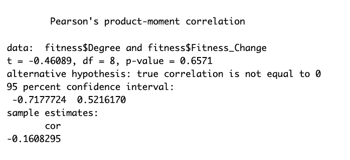

I ran a correlation test to see if there was a relationship between how connected someone was and how much their fitness changed. The result was a very weak negative correlation (r = -0.16), meaning there’s almost no relationship between training connections and improvement. The p-value was 0.66, which is way above 0.05, so the result isn’t statistically significant — this means we can’t say there’s a real connection between the two in this sample.

### Simple Linear Regression Results

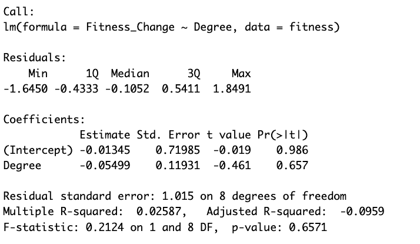

 ```{r}
#simple regression
model <- lm(Fitness_Change ~ Degree, data = fitness)
summary(model)
```
I also ran a simple linear regression to see if training connections (Degree) could predict changes in fitness. The results showed a small negative slope (Estimate = -0.055), meaning that for each extra training connection, fitness change slightly decreased — but the effect was super weak. The p-value was 0.66, which means the result isn’t statistically significant, and the R-squared value was only 0.03. So overall, this model doesn’t explain much — how connected someone was didn’t really predict whether they improved.

### Five Number Summary of Fitness Change

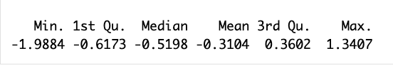

```{r}
# 5-number summary for fitness change
summary(fitness$Fitness_Change)
```
This 5-number summary gives a clear picture of how fitness changed across my team from peak to end of season. The minimum value was -1.99, meaning one athlete showed a big improvement — their heart rate dropped significantly for the same pace. The first quartile was -0.62, and the median was -0.52, which tells us that at least half of the team improved by a noticeable amount. The third quartile was 0.36, meaning that while most runners saw some improvement, a smaller group either stayed the same or got slightly less efficient. The maximum value was 1.34, showing that one athlete’s fitness actually declined. Overall, this summary shows that the majority of the team improved, but the amount of improvement varied widely.


## Conclusion & Research Limitations 

Overall, this project found that more socially connected athletes didn’t always show greater fitness improvement. While I expected that runners who trained with more teammates might benefit from group motivation or consistency, the data didn’t show a strong relationship between training ties and changes in heart rate-to-pace efficiency. Some athletes with fewer connections improved a lot, and others with strong training networks didn’t. This suggests that while social training might play a role, other factors like individual workload, injury, or recovery may be just as important.

There are a few limitations to keep in mind. The sample size was small — only a subset of my team responded to the survey — so it’s hard to draw strong conclusions. The data was also self-reported, which means athletes made subjective decisions about which runs to include. Although I tried to keep the dataset clean and consistent, people interpret “easy runs” and “typical performance” differently. As boyd and Crawford (2011) remind us, all data is shaped by human decisions — even when it looks objective on the surface.

This project wasn’t about finding perfect or definitive results — it was about exploring something meaningful within my own team. I wanted to see if the way we train together shows up in how our fitness changes over a season. Combining Garmin/Strava data with social network analysis gave me a new way to look at our training habits, not just as individuals, but as a group. If I were to continue this project, I’d love to expand it to include the full team or track changes across multiple seasons to see how our team dynamics evolve over time.

## References 

Barabási, A.-L. (2002). Linked: The new science of networks. Perseus Publishing.

boyd, d., & Crawford, K. (2011). Six provocations for big data. Retrieved from https://ssrn.com/abstract=1926431

Knappett, C. (2013). Network analysis in archaeology: New approaches to regional interaction. Oxford University Press.

Weingart, S. (2011). Demystifying Networks. Retrieved from https://scottbot.net/networks-done-right/

